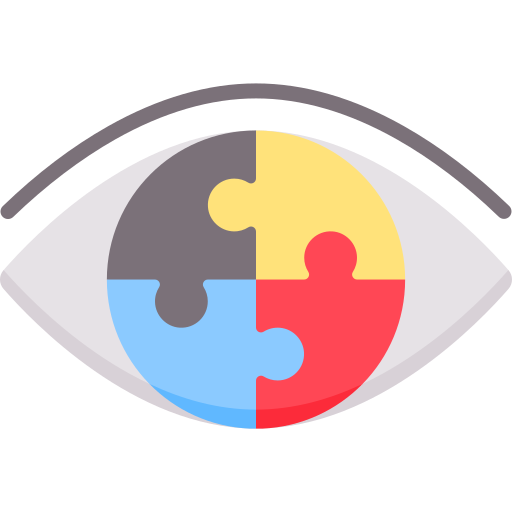
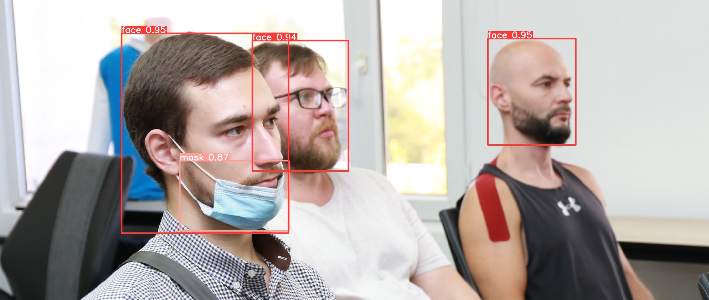
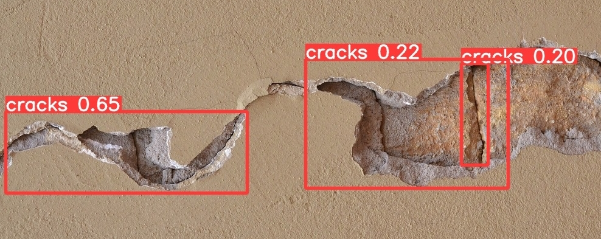

</img>
# CV Adventurer

A collection of Computer Vision projects and code samples.

### Contents
* Image preprocessing
* Model training using YOLOv5
* Face and mask detection
* Cracks detection

## Examples
#### Face and mask detection
</img>

#### Cracks detection
</img>

### LICENSE
This repository uses the MIT license.
