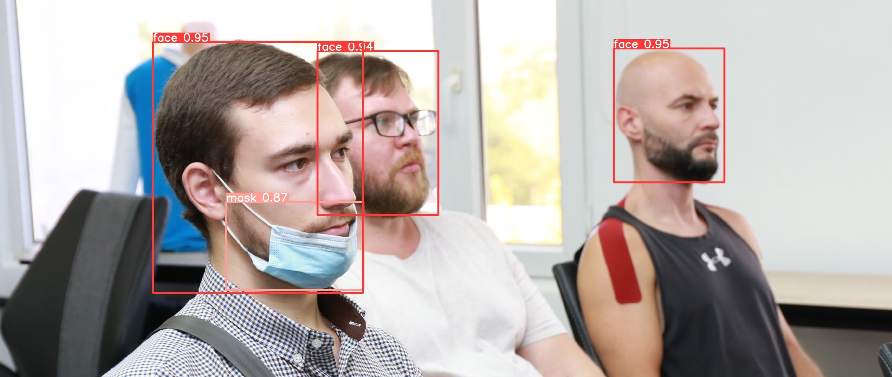

# Face-Mask Detection
This model detects a human face and a mask using YOLOv5.


## Images
All data was found via internet using [Yandex Images](https://yandex.ru/images/). All rights go to their respective owners.

## Requirements
* Python
* YOLO
* Install YOLO dependencies via `pip` (requirements.txt)

## Training
1. Clone this repository
```
git clone https://gitlab.com/kirill.saidov/cvadventurer.git
cd cvadventurer
```
2. Download YOLO
```
git clone https://github.com/ultralytics/yolov5.git yolov5
```
2. Modify `custom_config.yaml` in cvadventurer, then copy it to `yolov5/data`
```
cp custom_config.yaml yolov5/data
```
3. Create a data folder following the structure described here:
```
	- data
	    - images
			- train
			- test
			- val
	    - labels
			- train
			- test
			- val
```
Copy your images and annotations to these folders.
4. Train the model
```
python3 train.py --batch 16 --epochs 120 --data custom_config.yaml --weights yolov5x.pt --nosave --cache
```
Adjust the `--batch` variable depending on how much RAM you have.

5. Test your model
```
python3 detect.py --weights my/weights/folder/last.pt --img 640 --conf 0.5 --source my/data/folder
```
6. Export your model to ONNX and torchscript format
```
python3 export.py --weights ../weights/last.pt --data ../custom_config.yaml --img 640 --batch 1 --simplify
```

## Results
The results may be found at `yolov5/runs/train or detect/exp#`, where `#` is a number.
