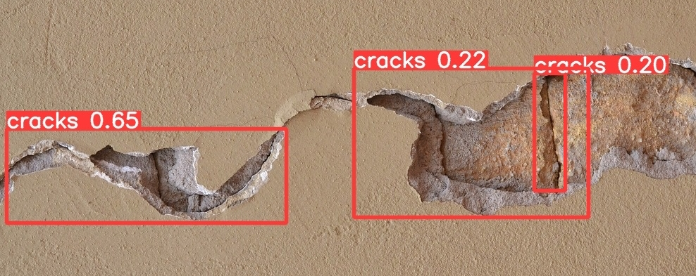

# Concrete Cracks Detection
This is a concrete cracks detection model using YOLOv5. 



## Images
All data was found via internet using [Yandex Images](https://yandex.ru/images/). All rights go to their respective owners.

## Model
The model was trained on 120 images for 30 epochs. It's accuracy is ~22.1%. It needs more data and epochs to run. It took an entire day to train the model on my laptop. I have tested what I wanted originally, more accuracy is a matter of time from now on.  

## Requirements
* Python
* YOLO
* Install YOLO dependencies via `pip install -r requirements.txt`

## Training
1. Download YOLO 
```
git clone https://github.com/ultralytics/yolov5.git yolov5
```
2. Modify and copy `custom_config.yaml` to `yolov5/data`
```
cp custom_config.yaml yolov5/data
```
3. Create a data folder with your images
```
- data
    - images
	- train
	- test
	- val
    - labels
	- train
	- test
	- val
```
4. Train the model
```
python3 train.py --batch 16 --epochs 120 --data custom_config.yaml --weights yolov5x.pt --nosave --cache 
```
Adjust the `--batch` variable depending on how much RAM you have. I have 8Gb, so I've used `--batch 4`. It was optimal on my setup. 
5. Test your model
```
python3 detect.py --weights ../weights/last.pt --img 640 --conf 0.5 --source my/data/folder
```

## Results
The results may be found at `yolov5/runs/detect/exp#`.


